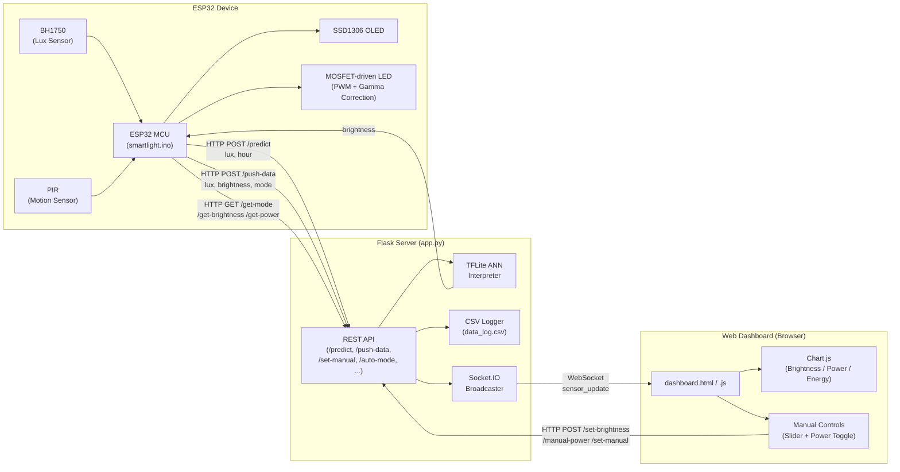
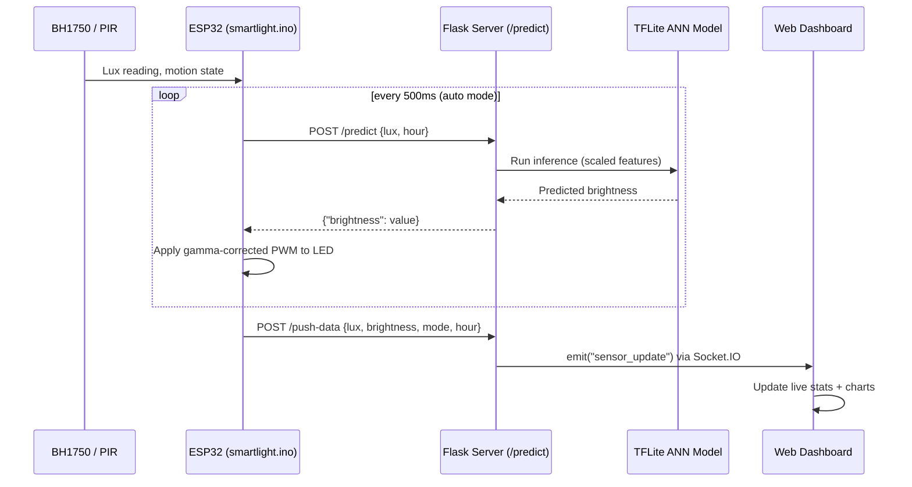
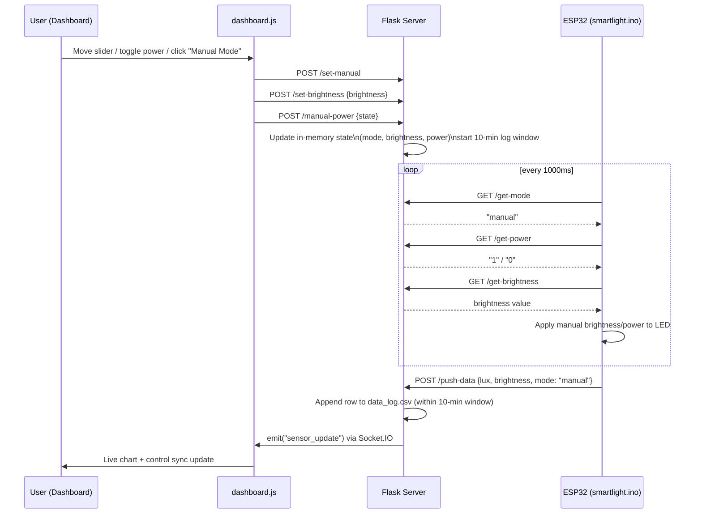

# 💡 Smart Adaptive Lighting System (ANN-Powered)

An IoT-based smart lighting system that uses an **Artificial Neural Network (ANN)** to autonomously predict and control LED brightness based on ambient light, time of day, and seasonal context — with a real-time web dashboard for monitoring and manual override.

---

## 📖 Overview

This project combines an **ESP32 microcontroller**, ambient light and motion sensors, and a **TensorFlow Lite ANN model** served through a **Flask + Socket.IO backend** to deliver intelligent, energy-aware lighting control.

The system continuously senses ambient lux levels and occupancy, sends this data to a Flask server for ANN-based brightness inference, and drives an LED via gamma-corrected PWM — while streaming live telemetry (lux, brightness, power, and cumulative energy) to a browser dashboard in real time.

It also includes an energy comparison model that estimates power/energy savings of the adaptive system against a traditional fixed-brightness LED fixture.

---

## ✨ Key Features

- 🧠 **ANN-based brightness prediction** — TensorFlow Lite model inferring optimal brightness from lux, hour, weather, and season features.
- 📡 **ESP32 + BH1750 + PIR** — real ambient light sensing and motion-based auto shut-off with a countdown grace period.
- 🖥️ **OLED live status display** on the device (lux, brightness, mode, motion, countdown).
- 🌐 **Real-time web dashboard** using Flask-SocketIO and Chart.js for live brightness, power, and energy visualization.
- 🎚️ **Manual override mode** — slider-based brightness control and power toggle from the dashboard.
- 📊 **Power & energy modeling** — voltage/current-based power estimation and cumulative energy tracking (Smart vs. Fixed LED comparison).
- 🗂️ **CSV data logging** during manual mode sessions for later analysis.
- 🔁 **Automatic mode synchronization** between the ESP32 and server (auto/manual, brightness, power state).

---

## 🏗️ System Architecture



**Data flow summary:**
1. ESP32 reads lux (BH1750) and motion (PIR) every cycle.
2. In **Auto mode**, ESP32 calls `/predict` on the Flask server, which runs the TFLite ANN model and returns a brightness value.
3. In **Manual mode**, brightness/power are set directly from the dashboard via `/set-brightness` and `/manual-power`, and the ESP32 polls `/get-mode`, `/get-brightness`, `/get-power`.
4. ESP32 pushes live readings to `/push-data`, which the server broadcasts over Socket.IO to the dashboard.
5. Dashboard renders real-time brightness, power, and energy comparison charts.

---

## 🔄 Sequence Diagrams

### 1. Auto Mode — ANN-Driven Brightness Prediction



### 2. Manual Mode — Dashboard Override



---

## 🧰 Tech Stack

| Layer | Technology |
|---|---|
| Microcontroller | ESP32 (Arduino framework) |
| Sensors | BH1750 (ambient light), PIR (motion) |
| Display | SSD1306 OLED (I2C) |
| ML Model | TensorFlow Lite (`.tflite`) ANN |
| Backend | Python, Flask, Flask-SocketIO |
| Real-time Comms | WebSockets (Socket.IO) |
| Frontend | HTML5, CSS3, JavaScript, Chart.js |
| Data Logging | CSV |

---

## 📁 Project Structure

```
ann-adaptive-lighting-system/
├── app.py                   # Flask server: ANN inference, Socket.IO, mode/state management, CSV logging
├── lighting_model.tflite    # Trained ANN model (not shown above, referenced by app.py)
├── lighting_model.py        # Converts the .tflite model into a C header/source pair for embedded use
├── lighting_model.h         # Generated C header exposing the model as a byte array
├── requirements.txt         # Python dependencies
├── smartlight.ino           # ESP32 firmware: sensing, PWM control, HTTP sync, OLED UI
├── static/
│   ├── dashboard.js         # Dashboard logic: Socket.IO client, charts, power/energy modeling
│   └── style.css            # Dashboard styling (dark theme, cards, toggle switch)
└── templates/
    └── dashboard.html       # Dashboard markup (live stats, manual controls, charts)
```

---

## ⚙️ ANN Model Details

The `/predict` endpoint expects `lux` and `hour`, and derives additional contextual features before inference:

| Feature | Description |
|---|---|
| `lux` (scaled) | Ambient light level ÷ 500 |
| `hour` (scaled) | Hour of day ÷ 23 |
| `motion` | Reserved feature slot |
| `weather_foggy` | Static (0) |
| `weather_rainy` | Static (0) |
| `weather_sunny` | Static (1) |
| `season_winter` | Derived from current month (Nov–Feb) |

The model outputs a raw brightness value that is clipped to **0–90%**, with a hard override to `0` when ambient lux is ≥ 500 (i.e., sufficient natural light).

---

## 🔌 API Reference

| Endpoint | Method | Description |
|---|---|---|
| `/` | GET | Serves the dashboard UI |
| `/predict` | POST | Runs ANN inference given `lux` and `hour`, returns predicted brightness |
| `/log-data` | POST | Broadcasts a sensor reading via Socket.IO (legacy path) |
| `/push-data` | POST | ESP32 telemetry push — broadcasts live data and logs to CSV in manual mode |
| `/set-manual` | POST | Switches system to manual mode |
| `/set-brightness` | POST | Sets manual brightness (starts a 10-minute logging window) |
| `/manual-power` | POST | Toggles light power on/off in manual mode |
| `/auto-mode` | POST | Switches system to ANN-driven auto mode |
| `/get-mode` | GET | Returns current mode (`auto` / `manual`) |
| `/get-brightness` | GET | Returns current manual brightness value |
| `/get-power` | GET | Returns current manual power state (`1`/`0`) |

---

## 🚀 Getting Started

### Prerequisites
- Python 3.9+
- ESP32 board with Arduino IDE (or PlatformIO)
- Libraries: `WiFi`, `HTTPClient`, `Wire`, `BH1750`, `Adafruit_GFX`, `Adafruit_SSD1306`

### 1. Backend Setup

```bash
git clone <repository-url>
cd ann-adaptive-lighting-system
pip install -r requirements.txt
```

Ensure `lighting_model.tflite` is present in the project root, then run:

```bash
python app.py
```

The server starts on `http://0.0.0.0:5000` with the dashboard available at `/`.

### 2. ESP32 Firmware Setup

1. Open `smartlight.ino` in the Arduino IDE.
2. Update the Wi-Fi credentials (`ssid`, `password`) and the `SERVER` IP address to match your Flask host's local IP.
3. Wire up the hardware:
   - **BH1750** → I2C (SDA: GPIO 21, SCL: GPIO 22)
   - **PIR sensor** → GPIO 33
   - **MOSFET gate (LED driver)** → GPIO 26 (PWM)
   - **OLED (SSD1306)** → I2C bus
4. Flash the firmware to the ESP32.

### 3. Access the Dashboard

Open `http://<server-ip>:5000` in a browser to view live sensor data, brightness/power/energy charts, and manual controls.

---

## 📊 Power & Energy Modeling

The dashboard estimates real-world power consumption using a brightness-to-voltage lookup table and a fixed maximum LED current, then integrates this over time to compute cumulative energy usage (Wh). This is directly compared against a constant-power fixed LED fixture to visualize energy savings achieved through adaptive dimming and motion-based shutoff.

---

## 🗺️ Roadmap

- [ ] On-device (edge) ANN inference using the generated `lighting_model.h`/`.cpp`, removing the network dependency for predictions
- [ ] Persistent database storage (replacing/augmenting CSV logging)
- [ ] Live weather API integration to replace static weather features
- [ ] Authentication for dashboard and control endpoints
- [ ] Mobile-responsive dashboard improvements

---

## 🙋 Author

**Shantanu Garg**
B.Tech CSE-AI, Graphic Era (Deemed to be University), Dehradun
